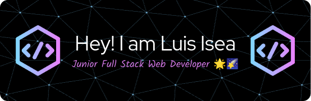

  

 
   
  
  
  

---

### :hammer_and_wrench: Languages and Tools

   
  
  
  
  

### 📖📔 Currently Learning

  
  
  

---

### 🥇 GitHub Stats

   

  

<!---
LuimiDev/LuimiDev is a ✨ special ✨ repository because its `README.md` (this file) appears on your GitHub profile.
You can click the Preview link to take a look at your changes.
https://github-readme-stats-delta-plum.vercel.app/
--->
