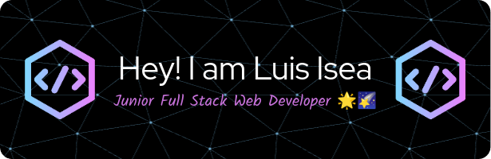

 &nbsp;
 &nbsp;

## Hi there! 👋

- 📚 I'm a B.S Computer Engineer Student at [Simón Bolívar University](https://www.linkedin.com/school/universidad-simon-bolivar/).
- 🔭 I'm currently working at [Seconds.link](https://www.linkedin.com/company/seconds-inc/) as a Junior Full Stack Web Developer.
- 🔧 I'm also a Linux System Administrator at [MAC USB](https://github.com/MAC-USB) in my University.
- 🌱 I'm currently coursing the [Full Stack open course](https://fullstackopen.com/en/) by the University of Helsinki.
- ⚡ Fun fact: I love reading and I'm close to reach my goal of reading 100 books.

I'm just starting this journey of creation and innovation. **Shaping the future, line by line**.

## 💻 Technology Stack

## 📖 Currently Learning

## 🏆 GitHub Stats

