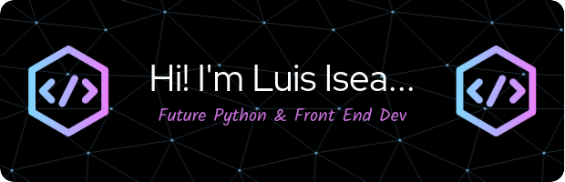

  
</>

 
   
  
  
  

- 👋 Hi, I’m Luis Miguel Isea (@LuimiDev)
- 👀 I’m interested in Python Development and why not a C++
- 🌱 I’m currently learning both Python and C++
- 💞️ I’m looking to collaborate on Python projects
- 📫 How to reach me: Gmail: isea.luis.miguel@gmail.com

  
  

<!---
LuimiDev/LuimiDev is a ✨ special ✨ repository because its `README.md` (this file) appears on your GitHub profile.
You can click the Preview link to take a look at your changes.
https://www.linkedin.com/in/luis-miguel-isea/
--->
